# Git101

We'll do all our backtracking work in this repo. So first let's grab everything in here.

```mkdir git101```
```cd git101```
```git clone git@github.com:JacobTsafatinos/Git101.git```


# Common Git Workflow 

## Most Common of Git Workflows (don't take anything for granted)

#### Set Up:
Have git set up. If you don't already have git then [install it!](https://git-scm.com/book/en/v2/Getting-Started-Installing-Git)

#### Situation:
You've just started work and you'd like to make your first change!

#### Solution:
```git clone <repo-url>```

```git checkout -b <branch-name>```

Now let's edit ```git_workflow_1.txt```

```git add <file-name>```

```git commit -m "Updating our docs"```

```git push --set-upstream origin <branch-name>```

#### What's Actually Happening:
There's a ton going on here. Given that this is our first example and the most common of git situations, we'll go over this step by step.

1. ```git clone``` is primarily used to point to an existing repo and make a clone or copy of that repo at in a new directory, at another location. As a convenience, cloning automatically creates a remote connection called ```origin``` pointing back to the target repository, and creates a local ```master``` branch for you. If you're curious, this is what ```git clone``` is doing behind the scenes:
   - ```git init``` (create the local repository)
   - ```git remote add origin <url>``` (add the URL to that repository)
   - ```git fetch``` (fetch all branches from that URL to your local repository)
   - ```git checkout``` (create all the files of the main branch in your working tree)
  
2. ```git checkout -b <branch-name>``` creates a new branch from wherever your current ```HEAD``` is, and moves the ```HEAD``` to point to the new branch. This command also is the combination of two other commands, it works as illustrated bellow:

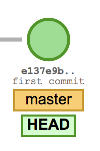 . 

```git branch <branch-name>``` simply creates a new branch with the name you give it, but leaves head pointing to the previous branch: 

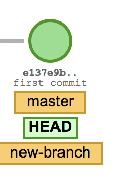  

```git checkout <branch-name>``` moves your HEAD to point to the newly specified branch:

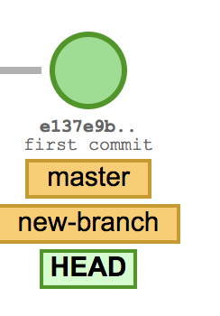 

3. ```git add``` moves whatever files you give it to the staging area (also known as the index). This tells git to include these files in the next commit.  

4.```git commit``` takes any files in the staging area and adds them to the local repository. More specifically it creates a new commit object containing your changes, a pointer to it's parent commit, and a SHA identifier, it then updates the HEAD to point to this newly created commit. [(as well as some other things that you can read about in this great post about the anatomy of a commit.)](https://blog.thoughtram.io/git/2014/11/18/the-anatomy-of-a-git-commit.html)  

5. ```git push --set-upstream origin <branch-name>``` sets the default remote branch for the current local branch. Any future remote commands, like git pull, will attempt to bring in commits from the <remote-branch> into the current local branch.  

Adding a remote tracking branch means that git then knows what you want to do when you git fetch, git pull or git push in future. It assumes that you want to keep the local branch and the remote branch it is tracking in sync and does the appropriate thing to achieve this.


## Squashing

#### Set Up:

Let's make a bunch of minor changes:

edit ```squashing.txt``` however you want.

```git add squashing.txt```

```git commit -m "some descriptive message"```

Do the above 3 more times.


#### Situation:

Imagine you have a bunch of small commits that are all related to the same logical change. We could just push this history which would be and accurate representation of the literal history, however it doesn't read very well if you're doing some git log debugging and you see a bunch of commits like "fixed typo", "forgot to change method name", "ate some spaghetti". What if we could squash all these commits down fewer commits that was more descriptive?

#### Solution:

```git rebase -i HEAD~3```

#### What's Actually Happening:

We'll go into more detail about ```git rebase -i``` later, but for now what's happening is we're going to merge all our commits into one logical commit. This new commit will contain all the changes of the squashed commits below it. Let's look at our ```git log``` before squashing, it looks something like this:

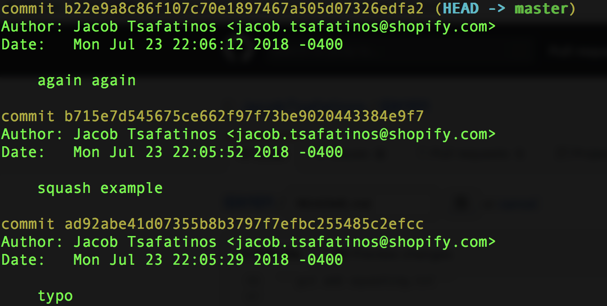

After typing ```git rebase -i HEAD~3``` We should see an editor pop up containing our 3 commits:

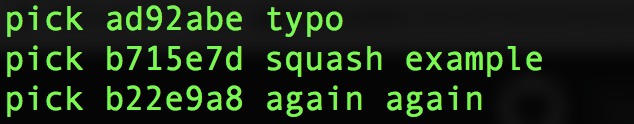

Now we'll pick the commits we want to squash:


And finally our commits have been squashed down to one new commit:

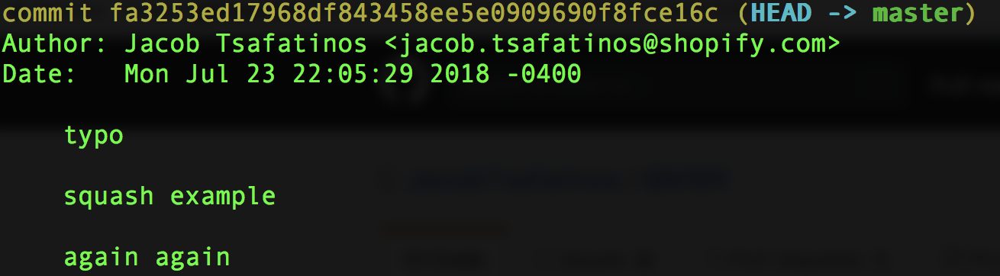


## Merging

#### Set Up:

let's make a branch: ```git checkout -b merging-branch-example```
Now let's edit ```merging-example.txt```
let's commit that change.

#### Situation:
We've got a branch with a nice new change on it. It's gone through imaginary code review, and now we want to have it on our local master.

#### Solution:
```git merge <branch-name>```

#### What's Actually Happening:

There are two cases here. 
Case 1 (Non-divergent branches):  
If your branches haven't diverged (your branch has all of masters commits) git will do a "fast-forward" merge, which doesn't create a new commit, but brings in the commits from your branch on top of masters.
Case 2 (Divergent branches):  

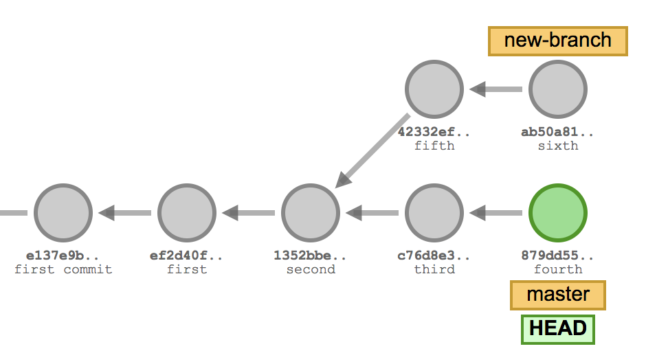

```git merge``` will look for the first common branch of our current branch, and the target branch. If there are no conflicting changes it will simply create a new "merge commit", which will have two parents as seen below. If there are merge conflicts you'll be asked to resolve them manually.

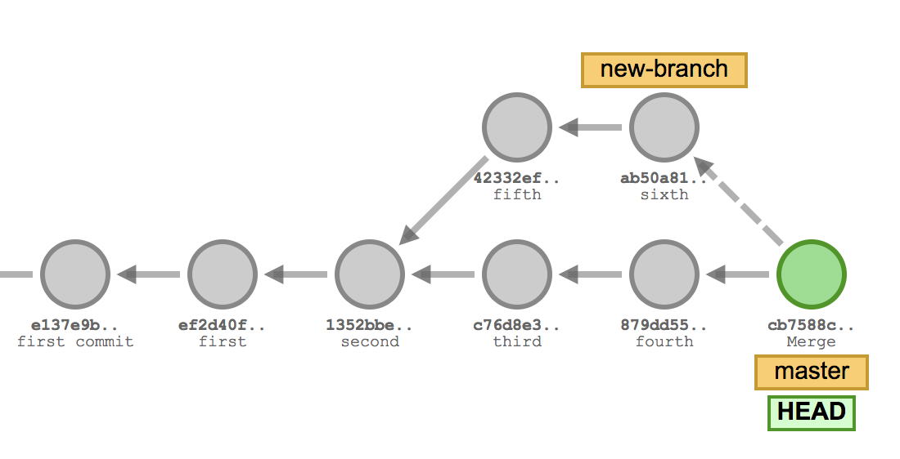

## Collaborative Work Simulation (Fixing Merge Conflicts)

#### Set Up:
Let's all ```git checkout master```. 
Great, now I want you to edit ```conflicts.txt```. 
I want you to alter the second word in ```conflicts.txt```. Change ```bananas``` to whatever you want. 
Great now everyone do ```git push```

#### Situation:
We're all in the same repo, working on the same file and we're racing against each other to get our changes out. Every time someone makes a change to the file and pushes we'll need to pull down those changes and fix any conflicts.

#### Solution:

```git pull```
**Fix Merge Conflicts**
```git add <fixed files>```
```git commit -m <message>```
```git push```

#### What's Actually Happening:

Git doesn't allow you to push to a remote repository if it contains work that you don't have locally. Because of this, you'll need to pull (git fetch, git merge) and fix any conflicting files, before you can push. 

## Rebase Instead of Merge

#### Set Up:
Make a branch and switch to it
Make some edits to ```rebase-vs-merge.txt```.
Commit these changes.

#### Situation:
We're on a branch with some of new changes. We now have a choice, we could merge this branch with master, or we could rebase. In this example we're going to rebase.

#### Solution:
```git rebase master```

#### What's Actually Happening:

Although ```rebase``` and ```merge``` have similar effect, the outcomes and process to which they get to that effect are completeley different. As we learned above, "merging" creates a brand new commit that has references to the branches it was merging togeter, and it looks like this:


"rebasing" takes every commit after the common ancestor, and copies them over one by one on top of ```master```. People like this approach because it maintains a linear history. If we always rebased we'd never have commits with two parents. It looks like this:

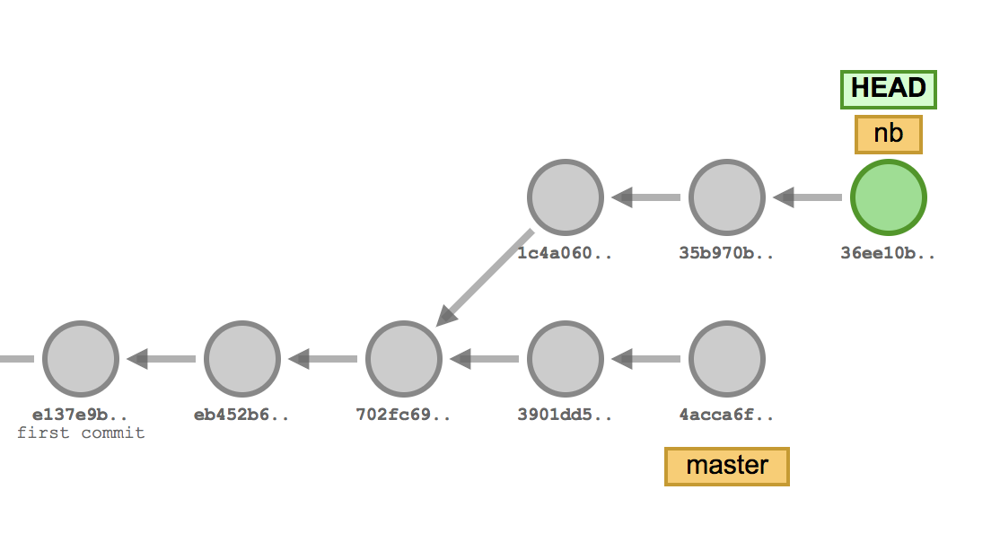


**Question:** Can you tell us what ```git pull rebase``` will do?


# Backtracking - How to Undo "Most" Things.


## Undo a Push

#### Set Up:

First let's make a new branch: ```git checkout -b undo-push```

Now let's edit ```push-example.txt``` however you like.

let's add, commit and push the change. (from here on we'll assume you know how to run the following commands)

```git add push_example.txt```
```git commit -m "some change"```
```git push```

Oh no this broke our imaginary service! We need to undo the changes.

#### Situation:
One of the most common mistakes. We made a change, pushed it and now we need to undo it.

#### Solution:
```git revert <SHA>```. 

#### What's Actually Happening:


```git revert``` creates a new commit that is the inverse of the SHA passed in (anything removed or added in the old commit will be reversed in the new commit). Revert is good because it doesn't alter any history, it simply creates a brand new commit removing your changes.

Now you can ```git push``` the new "inverse" commit to undo the broken one.


## Fix Your Last Commit

#### Set Up:
Let's edit ```fix_commit_messages.txt``` and let's ```add``` it to our staging area.

Now let's say we're being super productive and decide to get a little saucy with our commit messages. 

```git commit -m "getting shit done"```. 

#### Situation:

Oh no we just got the email from HR! Shopify took "get shit done" out of it's mandate. I guess we should fix this message or we'll look pretty stupid.

#### Solution:
```git commit -amend -m "getting work done"```. 

#### What's Actually Happening:
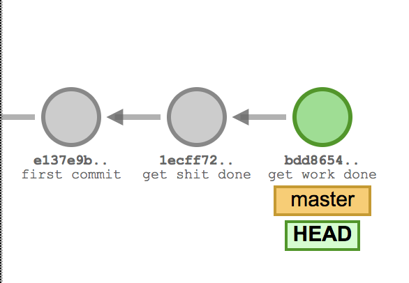

Now if we run ```git log``` we can see the new commit message. **NOTE: the commit SHA is now different than before**.

```git commit --amend``` updates and replaces the most recent commit with a new commit, which will combine any currently staged changes with the previous commit. If nothing is currently staged, then it just rewrites the previous commit message. Also if no message is specified then ```git commit --amend``` will open an edit window. We can use ammend to fix commit messages, or to add little trivial changes to our code (things like typos and other syntax issues).

## Resetting Local Changes

#### Set Up:
We're working on a project and going lightning fast! Let's make a bunch of changes and commit them.

Edit ```git-reset.txt``` however you like, then:
```git commit -am "awesome change"```

Edit ```git-reset.txt``` however you like, then:
```git commit -am "even better than last change"```

Edit ```git-reset.txt``` however you like, then:
```git commit -am "best of all changes right here!"```

#### Situation:
We've made some horrible commits! And what kind of messages are those? Let's reset the last 3 commits we just made because they're too horrible to stain our wonderful repo.

#### Solution:
```git reset <target SHA>```

#### What's Actually Happening:
Before resetting our history looked like so:

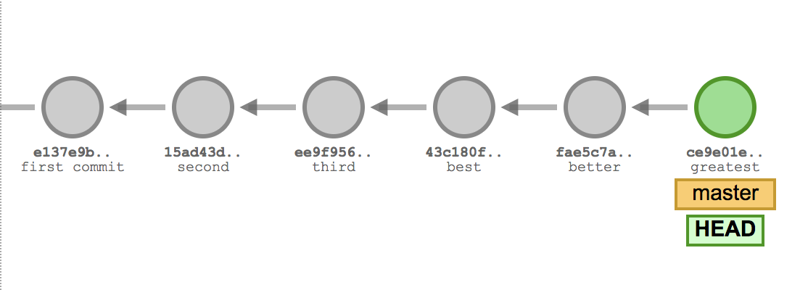

After running  ```git reset``` it now looks like:
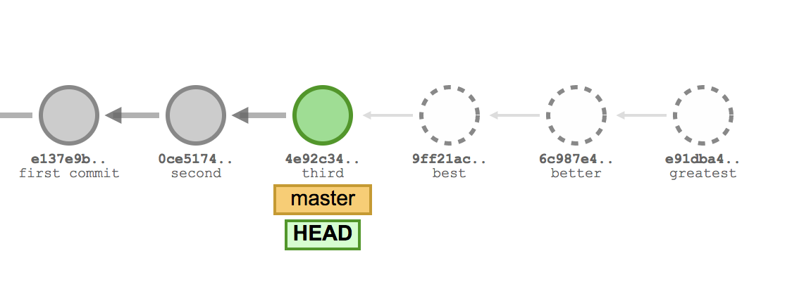

 ```git reset <target SHA>``` will change the repository's history back to what it looked like when we commited to the target SHA. It's important to note that ```git reset``` preserves the working directory, so although the commits are gone, the contents are still on disk. You can see them if you do ```git status```. Sometimes if you want to undo the commits and changes at the same time you can use ```git reset --hard <target SHA>```.

## Undo our Undo of Local Changes (De-mystifying Reflog)

#### Situation:
We just got rid of these changes and now you want them back already?! Fine. I know what you're thinking, we can just use the same technique we just learned and ```git reset``` to the last SHA... wait... I didn't keep track of the SHA's and my ```git log``` doesn't show them anymore. What do we do???

**Let's set up this situation:**
1. **First do this**
1. **Then this**
1. **Finally do this**

#### What's Actually Happening:

```git reflog``` is our best friend and saviour here. ```git reflog``` shows a history of all the times the ```HEAD``` has changed. This happens when we make commits, switch branches, do resets.

Here's what it looks like:
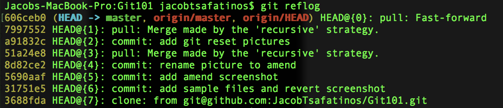

**NOTE:**
1. ```reflog``` is specific to you. You can't use reflog to restore someone elses un-pushed commits.
1. ```reflog``` doesn't last forever, if an object becomes "unreachable", git will garbage collect it eventually.

#### Solution:
Now that we're familiar with ```git reflog``` we can do a lot with it. We have a couple of options based on what we've learned so far: 
1. we could find the SHA we want and do ```git reset --hard <SHA>```.
1. If we want to replay a commit into our repo we could use the very useful ```git cherry-pick <SHA>``` (we'll talk more about ```cherry-pick``` soon)

## Forgetting That You Were on Master

#### Situation:
Picture this classic scenario. We've just made a bunch of commits, and are about to push, but crap we realize we're on ```master```. If only there was a simple quick way to make those commits on a branch.

**Let's set up this situation:**
1. **First do this**
1. **Then this**
1. **Finally do this**

#### Solution:

Follow this recipe: ```git branch <branch-name>``` -> ```git reset --hard origin/master``` -> ```git checkout <branch-name>``` -> ```git push --set-upstream origin <branch-name>```

#### What's Actually Happening:

A lot of things are happening here, let's go through them one by one.

1. ```git branch <name>```: You're most likely familiar with ```git checkout -b <name>``` when creating new branches. That's a short cut to make a branch and immediately switch to it. However we don't actually want to switch to the new branch yet. ```git branch <name>``` will create a new branch which points to your most recent commit, but leaves us at ```master```.
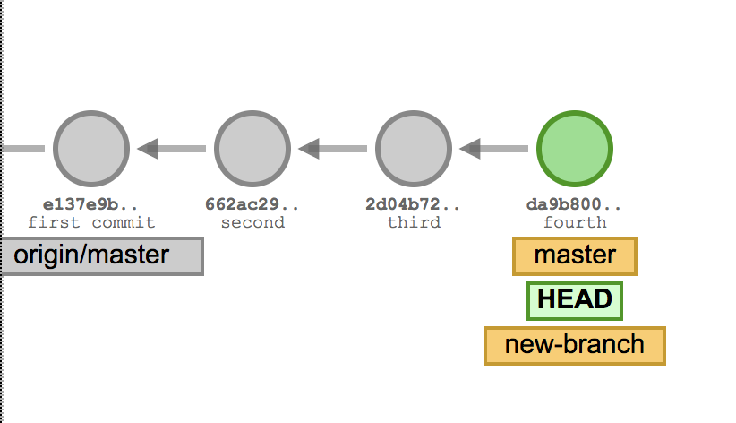
1. As we know ```git reset --hard origin/master``` will move ```master``` back to ```origin/master```, before we made any commits. This is okay because we've moved all our commits to the new branch first.
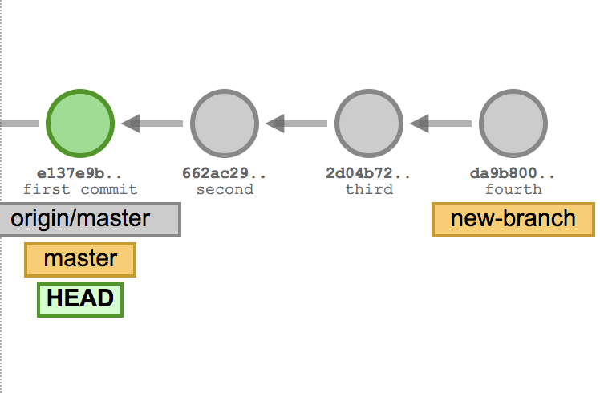
1. ```git checkout <name>``` moves our ```HEAD``` to point to the tip of our new branch.
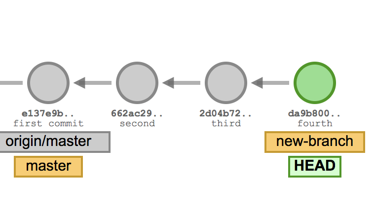
1. Finally we push the new commits up for review.
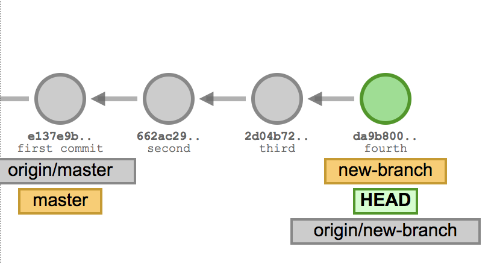

## What the Heck is Git Rebase -i Used for Anyway?
#### Situation:
Imagine we started work on an issue with one solution, but midway we found another way was better. We have a billion commits now, but only some of them are actually useful. We want to push but don't really care about some of them, in fact we want them gone entirely.

**Let's set up this situation:**
1. **First do this**
1. **Then this**
1. **Finally do this**

#### Solution:
```git rebase -i <earlier SHA>```

#### What's Actually Happening:

```-i``` stands for interactive, and therefore puts your ```rebase``` into "interactive mode". Before replaying any commits, it opens up an editor and allows us to edit each commit as it get's replayed.

The only columns that really matter are the first two. The **command** for the commit, and the **SHA** of the commit. By default ```rebase -i``` will assume you're picking every commit. It looks something like this:

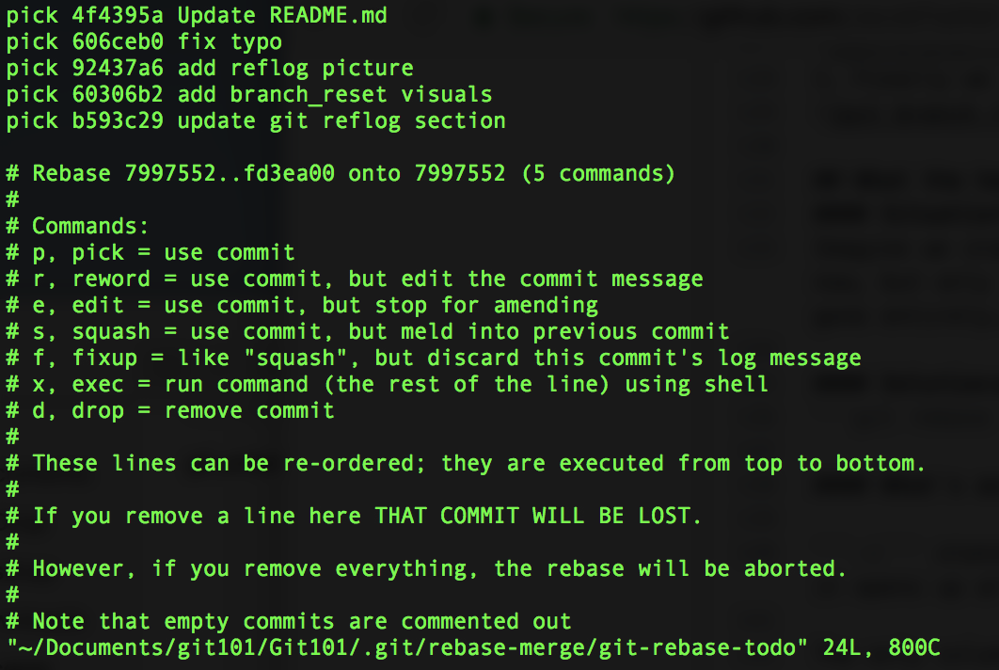

You may have seen this before when being told to do a rebase, and most people only ever use this for squashing down commits, but you can do much more. Some useful options:

1. ```reword``` let's us change the commit message. Not immediately, but at the time of replaying.
1. ```squash``` Will meld with the commit directly above it, but will prompt you to write a new commit message.
1. ```fixup``` like ```squash``` it melds "up" with the commit immediately above it, but it drops the commit message.
1. ```drop``` removes the commit. You could also achieve this by just deleting the line.

**NOTE: These actions will get applied when you save and quick your editor, this happens top to bottom. You can adjust the order of the commits by simply moving lines around.**

## Stop Tracking a File
#### Situation:
You accidentally added a file to your staging aread and now you want to stop tracking it.

**Let's set up this situation:**
1. **First do this**
1. **Then this**
1. **Finally do this**

#### Solution:
```git rm --cached <filename>```

#### What's actually happening:
Once a file has been added and commited, Git will continue to track changes in that file.

```git rm --chached <filename>``` will remove the file from tracking but won't touch it on disk. 

## ABANDON SHIP!!!! (cherry-picking)
#### Situation:
Rebase went sour? you have a million commits included in your change and you have no idea how they got there? Some weird config on your local machine is messing with your stuff? Don't sink with the ship, get there hell out of there and take only what you need with you!

**Let's set up this situation:**
1. **First do this**
1. **Then this**
1. **Finally do this**

#### Solution:

1. ```git checkout master``` (make sure it's up to date)
2. ```git checkout -b new_branch```
3. ```git cherry-pick <target SHA>```

#### What's actually happening:

This one isn't actually that complicated. First we move the head back to the ```master``` branch to make sure we're escaping the horrors of our branch. Then we create a new branch and move our head to it so we're starting fresh from whatevers on ```master```. Finally we grab the specified commits and make "copies" of them on top of our current branch. 

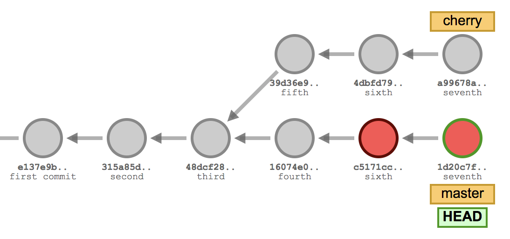


Notice that as we ```cherry-pick``` each commit, we're creating new ```SHA```'s, but the commit messages remain the same.

# backtracking todo:
1. git patching, and recovering from detatched head.

## The Final Boss
#### Set Up:
Do this
and this
and this
and this
and then this
and all these things

#### Situation:

We're in a really bad state here, there's many different things we can do to get out of this.

#### Solution:
Figure it out yourself!

#### What's Actually Happening:

You now know how to use Git.


# TODO

1. Collaboration simulation: create branch -> pull changes from someone else's branch -> make multiple commits -> squash commits down -> push changes back to that branch.
2. clone repo -> create branch -> make small change -> pull --rebase new changes from master (instead of merge) -> push into master
## Collaborative Work Simulation #2 (checkout someone else's branch)
3. Detatched Head
4. Accidentally rebase everyones commits into yours.
5. Create a really horrible situation and leave people to handle it on their own.
6. start debugging section - tips and tricks to figure out what went wrong. (reflog, diff, log, blame, bisect?(probably not)


**Bonus**

Stashing

Git Cheat Sheet

Handouts


