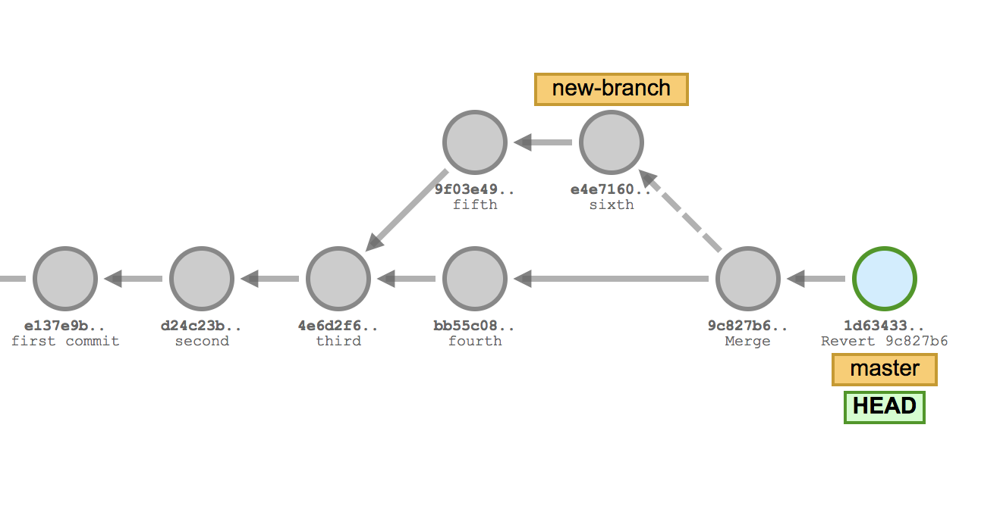

# Git101

# Backtracking - How to undo "most" things.

We'll do all out backtracking work in the backtracking repo. So first let's check it out.

```mkdir backtracking```
```cd backtracking```

```git clone <repo-address>```


## Undo a push

#### Situation:
One of the most common mistakes. We made a change, pushed it and now we need to undo it.

First let's make a new branch: ```git checkout -b undo-push```

Now let's edit ```push_example.txt``` however you like.

let's add, commit and push the change. (from here on we'll assume you know how to run the following commands)

```git add push_example.txt```
```git commit -m "some change"```
```git push```

Oh no this broke something! We need to undo the changes.

#### Solution:
```git revert <SHA>```. 

#### What's actually happening:



```git revert``` creates a new commit that is the inverse of the SHA passed in (anything removed or added in the old commit will be reversed in the new commit). Revert is good because it doesn't alter any history, it simply creates a brand new commit removing your changes.

Now you can ```git push``` the new "inverse" commit to undo the broken one.


## fix your last commit (message or code)
#### Situation:
Let's edit ```fix_commit_messages.txt``` and let's ```add``` it to our staging area.

Now let's say we're being super productive and decide to get a little saucy with our commit messages. 

```git commit -m "getting shit done"```. 

Oh no we just got the email from HR! Shopify took "get shit done" out of it's mandate. I guess we should fix this message or we'll look pretty stupid.

#### Solution:
```git commit -amend -m "getting work done"```. 

#### What's actually happening:


Now if we run ```git log``` we can see the new commit message with. **NOTE: the commit SHA is now different than before**.

```git commit --amend``` updates and replaces the most recent commit with a new commit, which will combine any staged changes with the previous commit. If nothing is currently staged, then it just rewrites the previous commit message. Also if no message is specified then ```git commit --amend``` will open an edit window.

## resetting local changes

#### Situation:
We're working on a project and going lightning fast! Let's make a bunch of changes and commit them.

```git commit -m "awesome change"```

```git commit -m "even better than last change"```

```git commit -m "best of all changes right here!"```

Wow those were horrible commits! And what kind of messages are those? Let's reset the last 3 commits we just made because they're too horrible to stain our wonderful repo.

#### Solution:
```git reset <target SHA>```

#### What's actually happening:
Before resetting out history looked like so:


After running  ```git reset``` it now looks like:


 ```git reset <target SHA>``` will change the repository's history back to what it looked like when we commited to the target SHA. It's important to note that ```git reset``` preserves the working directory, so although the commits are gone, the contents are still on disk. You can see them if you do ```git status```. Sometimes if you want to undo the commits and changes at the same time you can use ```git reset --hard <target SHA>```. Although we advise that you always use caution when using ```--hard```.

## Undo our Undo of local changes (secrets of reflog)

#### Situation:
We just got rid of these changes and now you want them back already?! Fine. I know what you're thinking, we can just use the same technique we just learned and ```git reset``` to the last SHA... wait... I didn't keep track of the SHA's and my ```git log``` doesn't show them anymore. What do we do???

#### What's actually happening:

```git reflog``` is our best friend and saviour here. ```git reflog``` shows a history of all the times the ```HEAD``` has changed. This happens when we make commits, switch branches, do resets.

Here's what it looks like:


**NOTE:**
1. ```reflog``` is specific to you. You can't use reflog to restore someone elses un-pushed commits.
1. ```reflog``` doesn't last forever, if an object becomes "unreachable", git will garbage collect it eventually.

#### Solution:
Now that we're familiar with ```git reflog``` we can do a lot with it. We have a couple of options based on what we've learned so far: 
1. we could find the SHA we want and do ```git reset --hard <SHA>```.
1. If we want to replay a commit into our repo we could use the very useful ```git cherry-pick <SHA>``` (we'll talk more about ```cherry-pick``` soon)

## Forgetting that you were on master branching

#### Situation:
Picture this classic scenario. We've just made a bunch of commits, and are about to push, but crap we realize we're on ```master```. If only there was a simple quick way to make those commits on a branch.

#### Solution:

Follow this recipe: ```git branch <branch-name>``` -> ```git reset --hard origin/master``` -> ```git checkout <branch-name>``` -> ```git push --set-upstream origin <branch-name>```

#### What's actually happening:

A lot of things are happening here, let's go through them one by one.

1. ```git branch <name>```: You're most likely familiar with ```git checkout -b <name>``` when creating new branches. That's a short cut to make a branch and immediately switch to it. However we don't actually want to switch to the new branch yet. ```git branch <name>``` will create a new branch which points to your most recent commit, but leaves us at ```master```.

1. As we know ```git reset --hard origin/master``` will move ```master``` back to ```origin/master```, before we made any commits. This is okay because we've moved all our commits to the new branch first.

1. ```git checkout <name>``` moves our ```HEAD``` to point to the tip of our new branch.

1. Finally we push the new commits up for review.


## What the heck is git rebase -i used for anyway? (WIP)
#### Situation:
#### Solution:
#### What's actually happening:

Imagine we started work on an issue with one solution, but midway we found another way was better. We have a billion commits now, but only some of them are actually useful. We want to push but don't really care about some of them, in fact we want them gone entirely.

```git rebase -i <earlier SHA>```

```-i``` stands for interactive, and therefore puts your ```rebase``` into "interactive mode". Before replaying any commits, it opens up an editor and allows us to edit each commit as it get's replayed.

The only columns that really matter are the first two. The command for the commit, and the SHA of the commit. By default rebase -i will assume you're picking every commit. You may have seen this before when being told to do a rebase, and most people only ever use this for squashing down commits, but you can do so much more. Some useful options:

```reword``` let's us change the commit message. Not immediately, but at the time of replaying.
```squash``` the most common case, will meld with the commit directly above it, but will prompt you to write a new commit message.
```fixup``` like ```squash``` it melds "up" with the commit immediately above it, but it drops the commit message.
```drop``` removes the commit. You could also achieve this by just deleting the line.

These actions will get applied when you save and quick your editor, this happens top to bottom. You can adjust the order of the commits by simply moving lines around.

## stop tracking a file (WIP)
#### Situation:
#### Solution:
#### What's actually happening:

You accidentally added something and now you want to stop

```git rm --cached <filename>```

## ABANDON SHIP!!!! (WIP)
#### Situation:
#### Solution:
#### What's actually happening:

Rebase went sour? you have a million commits included in your change and you have no idea how they got there? Some weird config on your local machine is messing with your stuff? Don't sink with the ship, get there hell out of there and take only what you need with you!

```git checkout master```
```git checkout -b new_branch```
```git cherry-pick <target SHA>```

What's happening here?

## maybe rebasing on master? might be covered already


# TODO
1. Basic workflow simulation: Clone repo -> Create branch -> Make change -> add/commit change (add new file based on participants name) -> push (set upstream) -> merge (no conflicts since all new files should be unique)
2. Squashing simulation: Same as #1 but introduce "PR feedback" and have them do multiple commits which they'll then have to either amend or squash.
3. Many people working on same repo simulation: Clone repo -> Create branch -> Make change -> add/commit change to existing file -> one at a time have them push/merge and keep fixing conflicts until there's no more conflicts to resolve.
4. Collaboration simulation: create branch -> pull changes from someone else's branch -> make multiple commits -> squash commits down -> push changes back to that branch.
5. clone repo -> create branch -> make small change -> pull --rebase new changes from master (instead of merge) -> push into master

